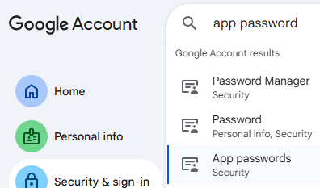

# LinkMonitor (Python)

## What does it do
- Takes a list of (url, title) pairs.
- Fetches and normalizes page content.
- Compares to last saved content (`data/<title>.txt`).
- If changed, it emails you and (optionally) attaches a screenshot.
- Saves the new content for next time.

## Quick start
1) Fill in your email credentials via environment variables (make an .env containing these properties):
```bash
export LM_SMTP_HOST="smtp.gmail.com"
export LM_SMTP_PORT="587"
export LM_SMTP_EMAIL="you@gmail.com"
export LM_SMTP_PASSWORD="YOUR_APP_PASSWORD" # e.g. App password key
export LM_TO="you@gmail.com,other@domain.com"
export LM_REQUESTS_CA_BUNDLE="./certs/cacert.pem" # you have to use the certificate provided by the page you monitor
export LM_PROFILE="news" # you can monitor different types of links: links_example.txt, links_news.txt
```
For Google, this is where you would you generate that App password key



2) Add your links inside `links_example-profile.txt` like so:
```text
https://example1.com/, Legacy-Announce
https://example2.com, New-Announce
```

3) (Optional) Install Playwright for screenshots:
```bash
pip install playwright bs4 requests
playwright install chromium
```
Without Playwright, emails will still be sent (just without screenshots).

4) Run it:
```bash
python link_monitor.py
```

## Notes
- Baseline: The first run saves content and does not notify; subsequent changes will notify.
- Files are stored in `./data/` by default. Override with `LM_DATA_DIR` env var.
