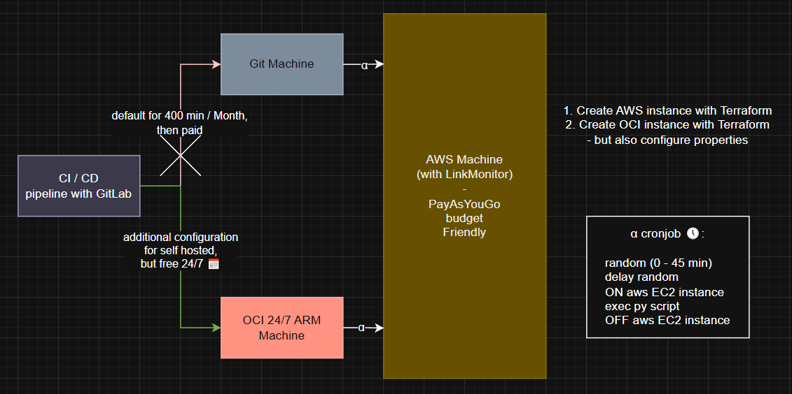

# 🔗💻 LinkMonitor: Hybrid Cloud Automation
- Smart web monitoring system on a budget
- This project uses a Hybrid architecture (OCI + AWS) 
- It monitors web pages, notifying through emails any content change 
- The system optimized for minimal costs


## 🗿 The architecture
The system is conceived to be Budget Friendly:
- **OCI (Oracle Cloud)**: GitLab Runner Self-Hosted (Free Tier 24/7), that orchestrates the system 
- **GitLab CI/CD**: Bypasses the 400 minutes per month limit, using own infrastructure
- **AWS EC2**: Instance based on PayAsYouGo model, turnt ON only during the Cronjob Alpha 




## 🛠️ Setup & Prerequisites
### 1. 🐍💻 Python Application
Create an ```.env``` file with the following content:
```bash
LM_SMTP_HOST=smtp.gmail.com
LM_SMTP_PORT=587
LM_SMTP_EMAIL=you@gmail.com
LM_SMTP_PASSWORD=YOUR_APP_PASSWORD # e.g. App password key
LM_TO=you@gmail.com,other@domain.com
LM_REQUESTS_CA_BUNDLE=./certs/cacert.pem # you have to use the certificate provided by the page you monitor
LM_PROFILE=news # you can monitor different types of links: links_example.txt, links_news.txt
```
- after this, create the link files inside ```links``` directory, following the ```links_example.txt``` tuple structure, where ```example``` will be the profile you use for the ```LM_PROFILE``` property
- run the ```link_monitor.py``` script
- More info inside: ```/docs/application```  

### 2. 👷‍♂️ AWS Infrastructure (The Worker)
Before running the code, we must prepare the AWS infrastructure:
- **IAM User**: **linkmonitor-automation** with **EC2FullAccess**, **SSMReadOnly**, **VPCReadOnly** permissions
- **Credentials**: configure AWS credentials and configs
- **EIP Note**: AWS's Elastic IP is **manually** handled (outside of Terraform) to allow fast rotation in case of IP-blocking
- More info inside: ```/docs/aws``` and ```/docs/terraform```  

### 3. 🎼 OCI Server (The Orchestrator)
To run the pipeline without any limits:
- Install GitLab Runner on OCI ARM 24/7 OCI Server
- Register the runner using the token generated inside GitLab
- **Tags**: use ```oci-arm``` to correctly redirect the jobs
- More info inside: ```/docs/gitlab``` and the **24-7-ARM-OCI-Server** project

-----------------

## 📈 Monitoring Logic
1. **Fetch**: Download the page content
2. **Compare**: Verify the differences
3. **Notify**: If there are differences, send and email with screenshots via Playwright (assuming it was installed)
4. **Cleanup**: The cronjob Alpha stops the EC2 instance to save money and resources

-----------------

## ⚙️ CI/CD Pipeline
Make sure you configured GitLab and have set the variables accordingly.
- Tip: use pipeline schedules to automatically monitor the runs (e.g. each run)
- see more inside: ```/docs/gitlab```


