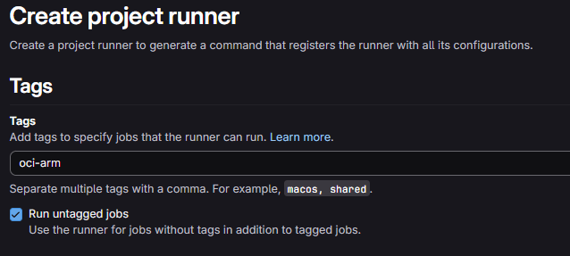
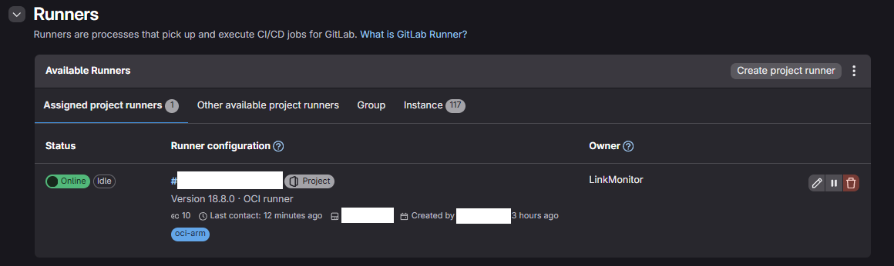
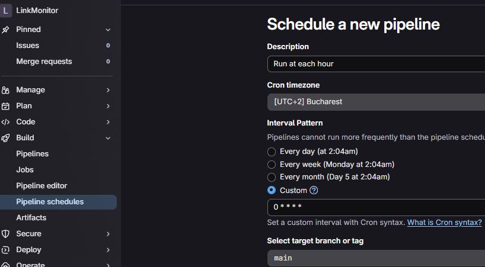
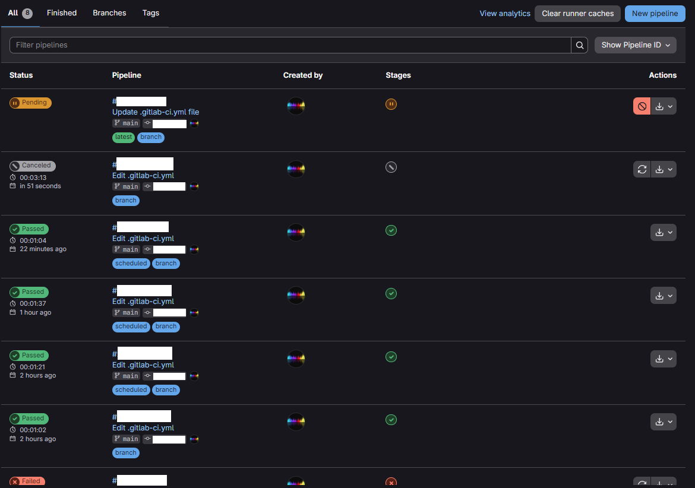

# GitLab Self Hosted
- this project is using the self hosted approah, so that we:
  - use our own resources and setup
  - bypass the 400 minutes per month limitation GitLab gives by default
  - use the OCI machine thoroughly
- you can also use the default runner provided by GitLab, but expect limitations


## Install GitLab Self Hosted on your desired machine (in my case, 24-7-ARM-OCI-Server)
- create the project runner by going to CI/CD Settings -> Register runner
- copy the token on the second page -> you will use it to register your self hosted runner


- assuming you have registered your self runner on that machine, this is what it should look like inside GitLab:




## If your pipeline is working and you want to make a cronjob that will execute repeatedly
- go to Build -> Pipeline schedules
- set a description, cron timezone and interval pattern (0 * * * * - for running each hour)




## Before running the pipeline, you must configure the environment variables, so that you can access your credentials:
```shell
LM_PROFILE=example # python profile to monitor
AWS_ACCESS_KEY_ID= # see access key id inside aws doc
AWS_EC2_INSTANCE_ID= # this is the id generated by terraform when it created the instance i-xsomenumbers57373 
AWS_EC2_PUBLIC_IP= # this is the ip your EC2 instance will have generated, or the one you set as EIP for your EC2
AWS_OUTPUT=json
AWS_REGION= 
AWS_SECRET_ACCESS_KEY= # see secret access key inside aws doc
SSH_PRIVATE_KEY= # see aws doc
```


## In the end, you should see your pipelines history too, so you can troubleshoot your issues


